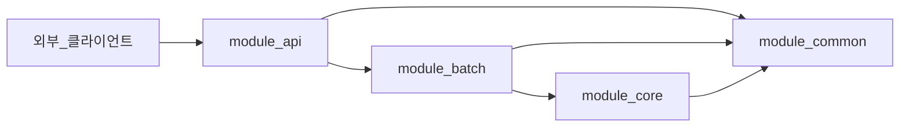

## Bottle Note Batch Server

### 개요(Overview)

> Bottle note 프로젝트의 Batch 서버입니다.

### module api

- 외부 클라이언트의 요청을 처리하고 응답을 반환합니다.
- 비지니스 로직등을 처리하지
- 배치의 `트리거`를 호출합니다
- 스케줄링 작업을 처리합니다

### module batch

- 배치를 처리합니다.
- 트리거 발동 시 `core`에서 필요한 정보를 가져옵니다.
- `core`에서 가져온 정보를 가공하여 필요한 작업을 수행합니다.
    - 처리된 결과를 core에 전달합니다.

### module core

- 데이터베이스와 연결하여 데이터를 처리합니다.
- `batch`에서 처리된 결과를 저장합니다.
- `batch`에서 필요한 정보를 가져옵니다.

### module common

- 공통으로 사용되는 모듈을 정의합니다.
- `api`, `batch`, `core`에서 공통으로 사용되는 모듈을 정의합니다.
- 응답값 , 예외 처리 등을 정의합니다.

